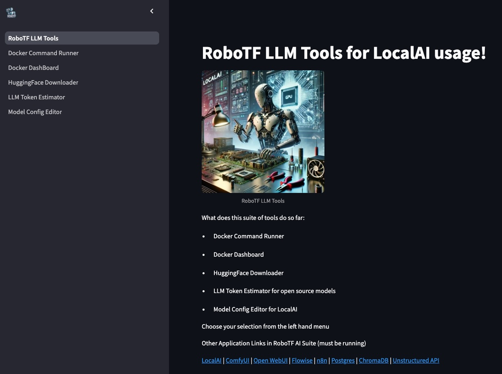

<!-- markdownlint-disable-file MD013-->
# RoboTF LLM Tools 🪙


This application is part of the [RobotF AI Suite](https://github.com/kkacsh321/robotf-ai-suite) and is designed to assist users running LocalAI via Docker. It provides a Streamlit-based interface with multiple pages to help manage and configure your LocalAI setup.

## Table of Contents

- [Description](#description)
- [Features](#features)
- [Getting Started](#getting-started-🧹)
  - [Docker Compose](#option-1-docker-compose)
  - [Docker from DockerHub](#option-2-docker-hub-container)
  - [Direct Python Development](#option-3-local-development)
- [Development Setup](#development-setup)
- [Contact](#contact)
- [Contributing](#contributing-👥)
- [License](#license-📜)
- [Acknowledgements](#acknowledgments-🏆)

## Description

Welcome to the RoboTF LLM Tools, a Streamlit web application that assists you in managing the [RobotF AI Suite](https://github.com/kkacsh321/robotf-ai-suite) project and [LocalAI](https://github.com/mudler/LocalAI) in a Docker based environment.

## Features

- **Model Configuration Editor**: Easily edit and manage your LocalAI model configurations through a user-friendly interface (`pages/Model_Config_Editor.py`)
- **Docker Command Runner**: Execute Docker commands directly through the app interface (`pages/Docker_Command_Runner.py`) REQUIRES you to mount the docker.sock!!
- **Docker Dashboard**: Show status of all the RoboTF AI Suite containers and interact with containers. REQUIRES you to mount the docker.sock!!
- **HuggingFace Download**: Download models directly from HuggingFace to your mounted models path (share with LocalAI)
- **LLM Token Estimator**: Estimate Tokens from different open source models directly in your browser. REQUIRES HF_TOKEN for private reposs
- **Streamlit-Based UI**: Modern web interface built with Streamlit framework (`RoboTF_LLM_Tools.py`)



## Getting Started 🧹

Choose your path with one of these three options:

### Option 1: Docker Compose

Docker Compose:

Clone the Repo:

```bash
git clone https://github.com/kkacsh321/robotf-llm-tools.git

cd robotf-llm-tools
```

Set Up Docker Compose: Ensure you have Docker and Docker Compose installed, Match up mount and env variables needed, then run:

```bash
docker-compose up -d --build
```

Run the App:

After Docker Compose has successfully built and started the containers, navigate to <http://localhost:8969> in your web browser.


### Option 2: Docker Hub Container

For those who wish to pull the pre-built container from Docker Hub:

Pull the Docker Image using latest tag (example v0.0.5):

```bash
docker pull robotf/robotf-llm-tools:latest
```

Run the Container:

```bash
docker run -d robotf/robotf-llm-tools \
  -e HF_TOKEN=<hf token> \ # HuggingFace Token
  -e MODELS_DIR=/models \ # Where to mount models volume in container
  -p 8969:8969 \
  -v /var/run/docker.sock:/var/run/docker.sock \ # important to run docker commands through the applications!
  -v <localai models path>:/models \ # The directory you store your LocalAI models in
```

Open your web browser to <http://localhost:8969> and let the fun begin.


### Option 3: Local Development

For those who wish to tinker with the source code:

Clone the Repo:

```bash
git clone <git clone https://github.com/kkacsh321/robotf-llm-tools.git>

cd robotf-llm-tools

# Install Dependencies:

pip install -r requirements.txt
```

Run the App:

```bash
streamlit run RoboTF_LLM_Tools.py
```

or using gotask

```bash
task run
```

Follow the Streamlit link to your web browser, or navigate to the provided local URL <http://localhost:8969>

## Development Setup

This repo uses things such as precommit, task, and brew (for Mac)

Mac:
Run the setup script (if on mac with brew already installed):

```sh
./scripts/setup.sh
```

Otherwise install the required Python packages:

```sh
pip install -r requirements.txt
```

This command installs all the necessary packages, including Streamlit, langchain components, etc.

Running the App
To run the app, navigate to the app's directory in your terminal and execute the following command:

with task:

```sh
task run
```

with docker:

```sh
task docker-load && task docker-run
```

with just plain streamlit

```sh
streamlit run RoboTF_LLM_Tools.py
```

## Environment Variables

If you need to access private Huggingface repos you will need to set the environment variable of `HF_TOKEN` to your huggingface api key.

This can be done locally by doing:

```bash
export HF_TOKEN=<insert token>
```

In the docker compose file by replacing the `HF_TOKEN` variable

Using docker by passing it at the docker run statement

```bash
docker run -e HF_TOKEN=<insert token> -p 8505:8505 robotf/robotf-llm-token-estimator
```

## Contact

<robot@robotf.ai>

## Contributing 👥

Feel free to fork this repository and submit pull requests. For major changes, please open an issue first to discuss what you would like to change.

Create a new branch

```bash
git checkout -b feature/your-cool-feature

# Make your changes.

# Commit your changes 
git commit -m 'I added X or fixed Y'

# Push to the branch 
git push origin feature/your-cool-feature

# Open a pull request and prepare to share your nightmare with the world.
```

## License 📜

This project is licensed under the MIT License - see the LICENSE file for details, but be warned: using this software may result in unintended issues.

## Acknowledgments 🏆

Thanks to the Hugging Face community for providing a wide range of models and tokenizers.

Special thanks to the developers of the [autotiktokenizer](https://github.com/bhavnicksm/autotiktokenizer) library for making it easy to work with different tokenizers.

Go support our friends at [LocalAI](https://github.com/mudler/LocalAI)